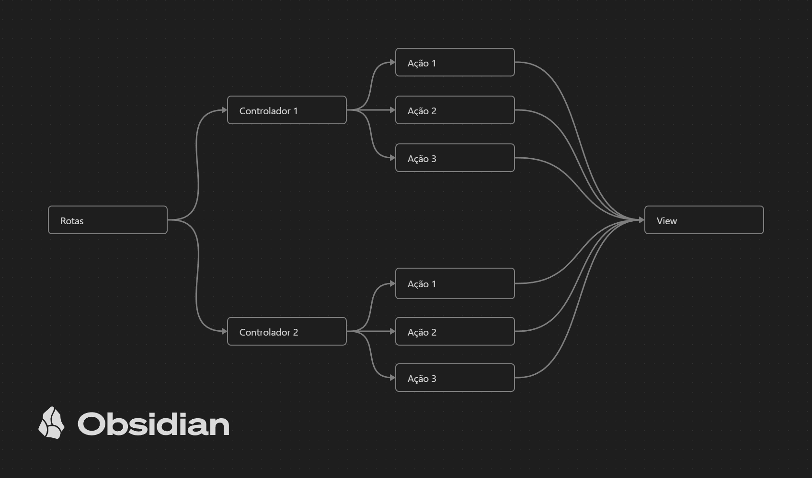
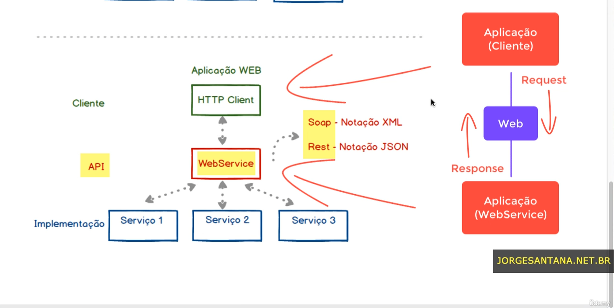

# Laravel-Udemy

- Comando utilizado para inicializar o projeto: composer create-project --prefer-dist laravel/laravel app_super_gestao

### Artisan:

##### Comandos básicos artisan

- php artisan list                      # Lista todos os comandos do artisan.
- php artisan serve                     # Inicializa o localhost do laravel.
- php artisan down                      # Coloca a aplicação em manutenção.
- php artisan up                        # Retira a aplicação do modo de manutenção.
- php artisan make:controller {nome}    # Cria um controlador.
- php artisan route:list                # Lista todas as rotas da aplicação.
- php artisan view:clear                # Limpa as views compiladas no cache.
- php artisan make:model                # Cria um model, caso ele tenha como objetivo salvar dados no banco, acrescentar o comando '-m' para criar 
                                           uma migration (sempre criar models com o nome no singualar).
- php artisan make:model -mcr {nome}	# Cria um Model, um Controller e uma Migration para o recurso especificado.
- php artisan make:model -all {nome}	# Cria todos os recursos associados à esse model.
- php artisan storage:link 				# Cria um caminho simbólico para o diretório storage, para que os arquivos possam ser acessados publicamente

### Migrations

- php artisan migrate                   # Executa uma migration.
- php artisan migrate:rollback          # Reverte as alterações feitas pelas migrações.
- php artisan migrate:status            # Mostra a situação de todas as migrações executadas.
- php artisan migrate:reset             # Executa os métodos Down de todas as migrações executadas.
- php artisan migrate:refresh           # Executa os métodos Down de todas as migrações, porém logo em seguida executa o migrate novamente.
- php artisan migrate:fresh             # Realiza o Drop de todos os objetos de banco e em seguida executa o método Up de todas as migrações.

### Tinker

- php artisan tinker                    # É um um console interativo que permite acessar e manipular as classes do projeto.
- $foo = \App\Models\{Class}::all()     # Recupera todos os registros associados à determinada classe.

### Rotas:

##### Há quatro arquivos principais de rotas:

- API       # Registra rotas de API's, não suportando cookies ou sessions.
- Channels  # Registra rotas para comunicação broadcasting, ou seja, serve para utilizar comunicação em tempo real como websockets.
- Console   # Serve para a criação de comandos personalizados que podem ser executados no Artisan.
- Web       # Serve para trabalhar com rotas padrões web, carregando páginas no back-end e serviando-as ao client, suportando cookies e sessions.

### Controllers

### Seeders

- São responsáveis por semear o banco de dados da aplicação com os dados iniciais da configuração, ou dados de teste, definindo classes Seeders que conterão as instruções para semear as tabelas no banco de dados, essas classes podem ser chamadas pela classe DatabaseSeeder.

- php artisan make:seeder {nome}.           # Cria um seeder
- php artisan db:seed                       # executa as seeds.
- php artisan db:seed --class={nome}.       # executa uma seed em específico

### Factories

- Uma factory permite através de um seeder semear em massa uma tabela no banco de dados.
- php artisan make:factory {nome} --model={nome} # Cria e define o modelo base para a factory

### Middlewares

- São camadas de software implementadas entre aplicações distintas, funcionando como um intermediador de comunicação.
- Foram criados como uma forma de ligação entre sistemas novos e legados, pois permite isolar as aplicações e possibilitando focar nas novas aplicações sem se preocupar com detalhes técnicos dos sistemas legados.
- No contexto web, atuam como um interceptador de requisições feitas por HTTP e também na resposta dessas requisições.
- A idéia de um Middleware é capturar a requisição antes que ela seja enviada ao núcleo da aplicação, permitindo que inúmeras ações sejam tomadas nesse momento, como por exemplo:
    - Verificar se o usuário está autenticado 
    - verificar o nível de permissão do usuário e permitir o acesso de rotas autorizadas.
    - Coletar o endereço de IP do usuário e caso necessário bloquear o acesso.
    - Registrar os acessos realizados as rotas, podendo registrar o nome do usuário que realizou o acesso, o horário, IP do origem, navegador utilizado, etc.
    - Verificar se o usuário aceitou os termos de uso da aplicação para liberar o acesso ao mesmo.
- Para criar um middleware basta utilizar o comando: php artisan make:middleware {nome}

### Verbos/Métodos HTTP

- Link auxiliar: https://developer.mozilla.org/pt-BR/docs/Web/HTTP/Methods

- GET: O método GET solicita a representação de um recurso específico. Requisições utilizando o método GET devem retornar apenas dados.

- POST: O método POST é utilizado para submeter uma entidade a um recurso específico, frequentemente causando uma mudança no estado do recurso ou efeitos colaterais no servidor.

- HEAD: O método HEAD solicita uma resposta de forma idêntica ao método GET, porém sem conter o corpo da resposta.

- PUT: O método PUT substitui todas as atuais representações do recurso de destino pela carga de dados da requisição.

- PATCH: O método PATCH é utilizado para aplicar modificações parciais em um recurso.

- DELETE: O método DELETE remove um recurso específico.

- CONNECT: O método CONNECT estabelece um túnel para o servidor identificado pelo recurso de destino.

- OPTIONS: O método OPTIONS é usado para descrever as opções de comunicação com o recurso de destino.

- TRACE: O método TRACE executa um teste de chamada loop-back junto com o caminho para o recurso de destino.

### Artisan UI

- php artisan ui {framework} --auth  -> Inicializa o Laravel UI utilizando o framework definido, como Bootstrap, React ou Vue e também cria os métodos de autenticação

### Artisan Mail

- php artisan make:mail {nome_classe} --markdown {view_associada_a_classe}

# API's, WebServices e REST

- SOAP: Notação XML.
- REST: Notação JSON.

### REST

Significa "Representational State Transfer" ou "Transferência Representacional de Estado"

- Comando utilizado para inicializar o projeto: composer create-project --prefer-dist laravel/laravel=8.5.9 app_locadora_carros

